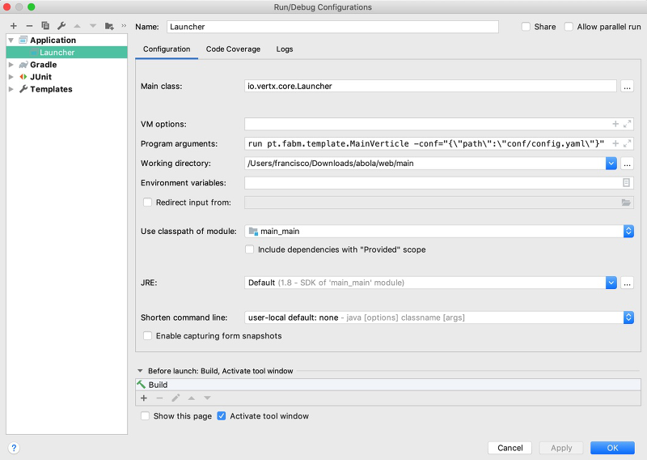

# frontend module
Module made to run in the browser side with a couple of frontend tecnologies like webpack, typescript, react, redux etc...

The fastest way to see the changes that you do in typescript code is to run webpack:

    cd frontend
    ./node_modules/.bin/webpack-dev-server

The frontend module in ```/api``` path will forward de calls to http://localhost:8888 , for this reason you should start the main verticle

# main module
Module, that has in it core a verticle to start the other verticles, to decouple the application as a whole.

Verticles that will be start:

- A rest verticle in module *rest*
- A dao verticle in module *dao* (implemented in memory-dao)

In the application all verticles have thier module and each module has only one verticle

This verticles comunicate to each other with the eventBus from vertx

The configuration file has the classes with the verticle implementation to make the replacement easy to do :simple_smile:

``` yaml
verticles:
  dao: pt.fabm.template.dao.MemoryDao
  rest: pt.fabm.template.rest.RestVerticle
```
It's also necessary to pass in the config file the host and the port to publish the services

``` yaml
confs:
  rest:
    port: 8888
    host: localhost
```

To launch the application in one IDE like Intellij for instance we need to configurate the Launcher call

Example:


parameters: run pt.fabm.template.MainVerticle -conf="{\\"path\\":\\"conf/config.yaml\\"}"
# rest module
Module to publish the services, *dao* is called within, through the event bus calls

# dao module
Module to persist or read de data needed in the other modules, this module has messsage consumers from event bus.

To pass messages with specific objects is required to construct an implementation of a MessageCodec. In the case that the sender and the receiver are in the same classloader we have amost none overhead, since the method that will be used is normally *transform*, the parameter might be the same has the returned

# shared module
Module to create the models used in *rest* and *dao*, as well as the correspondent MessageCodec's

#### caveats
In intellij, the resources are not created in the build folder (normally is *out* directory) in contrast of what's happen in gradle, for that reason the gradle project have two taks to mitigate the problem.
  - copyIntellijMainRessources used to copy the main resources to *out* directory
  - copyIntellijTestRessources used to copy the test resources to *out* directory

# creating package to production
## Before create the final package

To assure that all the html javascript and css are in the *rest* module in public directory located in resources

To generate the content from frontend module it's required to execute the root task *compileAndCopy*

## After frontend sources are copied to public directory
In `web:main` package there is a `installDist` task to create all jars (main module and dependencies)

Located in install/template will be our application ready to production, in *bin* directory will be the executable scripts, *main* for unix like systems and *main.bat* for windows. In *lib* directory will be all the jars needed to run the app.
The **config.yaml** is the yaml file used to store the configuration.
* bin
  * main
  * main.bat
* lib
  * ... dependecies and module archive, jars in general


To run the app in path `web/main/build/install/template` execute the command:

```shell
./bin/main run pt.fabm.template.MainVerticle -conf="{\"path\":\"config.yaml\"}"
```

# Authentication
The autentication is made with a custom handler, the handler creates a jwt token in a cookie. The token security is based on a key and that key is not in the sources for security reasons, but in compile time gradle will apply a filter in a resource *app.properties*, since the key is not directly in the build scripts is necessary to introduce the parameter *app.key* to be executed when gradle process the resources

1. pass parameter when call gradle
    ``` shell 
    ./gradlew build -Papp.key=myKeyValue
    ```
1. or save it in init script
    
    ``` groovy
    gradle.allprojects{
      if(!project.hasProperty('app.key')){
          project.ext['app.key'] = 'my pass phrase must be long enough to be safe'
      }
    }
    ```
  
    By default located at USER_HOME/.gradle/init.gradle if it doesn't exist yet, you can create it
  
    more about init script [here](https://docs.gradle.org/current/userguide/init_scripts.html) 
